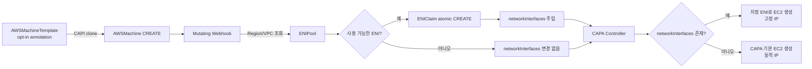

# CAPA ENI Controller

CAPA ENI Controller는 Cluster API Provider AWS(CAPA)가 생성하는 EC2 노드에
사전에 준비된 Elastic Network Interface(ENI)를 선택적으로 할당하는 Kubernetes
확장 컨트롤러입니다.

일반적인 `AWSMachineTemplate` 기반 흐름을 유지하면서, opt-in annotation이 있는
템플릿에서 생성된 `AWSMachine`에만 ENI Pool을 적용합니다. 사용할 수 있는 ENI가
없으면 `AWSMachine.spec.networkInterfaces`를 비워 두어 CAPA와 AWS의 기본 동적
private IP 할당 방식으로 진행합니다.

## 목표

- `AWSMachineTemplate`과 `MachineDeployment`의 표준 생성 흐름 유지
- 사람이 등록한 ENI 목록을 Region 및 VPC 단위 Pool로 관리
- 각 `AWSMachine`에 서로 다른 ENI를 안전하게 할당
- Pool 고갈 시 CAPA 기본 네트워크 할당으로 자동 fallback
- Machine 삭제 및 재생성 과정에서 ENI 할당 상태를 일관되게 관리

## Opt-in 사용법

annotation은 `AWSMachineTemplate.metadata`가 아니라 복제 대상인
`spec.template.metadata`에 설정해야 합니다.

```yaml
apiVersion: infrastructure.cluster.x-k8s.io/v1beta2
kind: AWSMachineTemplate
metadata:
  name: worker
  namespace: workload-cluster
spec:
  template:
    metadata:
      annotations:
        eni.dcn.ssu.ac.kr/allocate-from-pool: "true"
    spec:
      instanceType: m5.large
```

annotation이 없는 템플릿에서 생성된 `AWSMachine`은 Webhook과 allocator의
처리 대상이 아니며 기존 CAPA 방식으로 생성됩니다.

## ENI Pool 예시

사용자는 Pool의 Region, VPC ID, ENI ID와 각 ENI의 primary private IPv4를
입력합니다. AZ 및 subnet은 입력하지 않습니다.

```yaml
apiVersion: networking.dcn.ssu.ac.kr/v1alpha1
kind: ENIPool
metadata:
  name: prod-ap-northeast-2
spec:
  region: ap-northeast-2
  vpcID: vpc-0123456789abcdef0
  exhaustionPolicy: Dynamic
  interfaces:
    - id: eni-00000000000000001
      privateIP: 10.20.1.25
    - id: eni-00000000000000002
      privateIP: 10.20.1.26
```

현재 구현은 AWS API를 호출하지 않는 trust mode로 동작합니다. 사용자가 선언한
ENI ID, VPC와 primary private IPv4가 정확하다고 가정하며, Claim이 없는 ENI를
사용 가능하다고 판단합니다. 할당 가능한 ENI는 private IPv4의 숫자값이 작은
순서로 선택됩니다. AZ와 subnet은 입력하지 않으며, 선택된 ENI가 가진 네트워크
속성에 맞춰 CAPA와 EC2가 생성을 진행합니다.

## 처리 흐름



CAPA v2.13에서 `AWSMachine.spec`은 생성 후 변경할 수 없으므로 ENI는 CREATE
admission 시점에 예약하고 주입합니다. 상세 sequence, 트리거 조건, 분기와 대표
operation은 [`docs/operation-flow.md`](docs/operation-flow.md), API와 설계 원칙은
[`docs/design.md`](docs/design.md)를 참조하십시오.

## 현재 상태

CRD, CREATE admission 기반 Claim allocator, Pool inventory, 동적 fallback 및 ENI
회수 로직을 포함합니다. CAPA v2.13 환경에서 사전 생성 ENI가 worker EC2의 primary
interface로 연결되고, Pool 선언 IP와 Machine `InternalIP`가 일치하는 것을
검증했습니다.

## 개발 및 설치

필수 조건은 Go 1.26 이상, Docker, `kubectl`, Kustomize 및 cert-manager입니다.

```bash
make manifests generate test
make docker-build docker-push IMG=<registry>/capa-eni-controller:<tag>
make deploy IMG=<registry>/capa-eni-controller:<tag>
kubectl apply -f config/samples/networking_v1alpha1_enipool.yaml
```

Webhook 인증서는 Kubebuilder 기본 구성에 따라 cert-manager가 발급합니다.
Controller 자체는 AWS API를 호출하지 않으므로 AWS IAM 자격 증명이 필요하지
않습니다. EC2와 ENI를 연결하는 권한은 기존 CAPA controller가 계속 담당합니다.

`package/` 디렉터리는 렌더링된 설치 YAML과 `Kptfile`을 포함하는 KPT 패키지입니다.
실제 workload
cluster용 CAPI 리소스는 별도 KPT 패키지에서 관리하고, opt-in하려는
`AWSMachineTemplate.spec.template.metadata.annotations`에 위 annotation을
추가하십시오.
