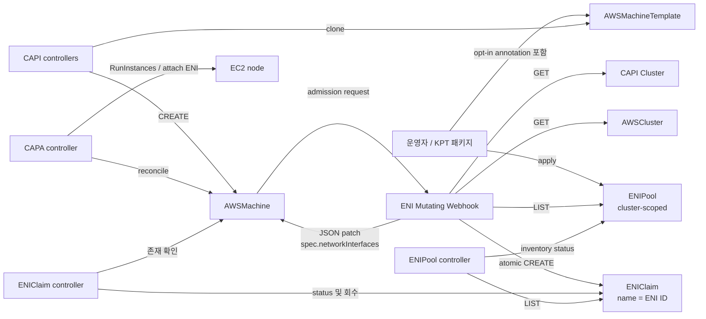
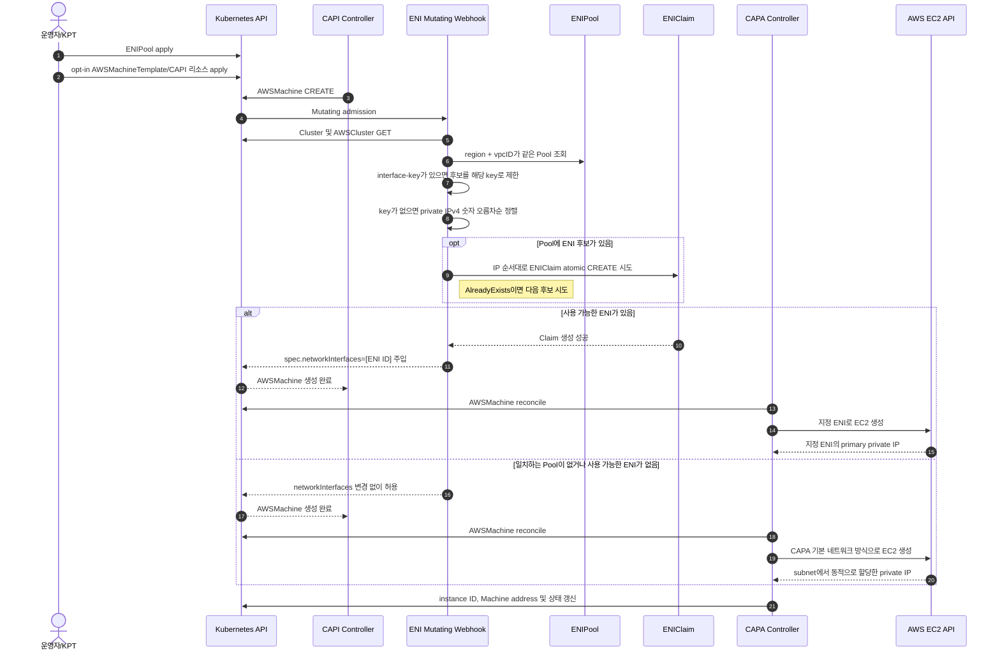
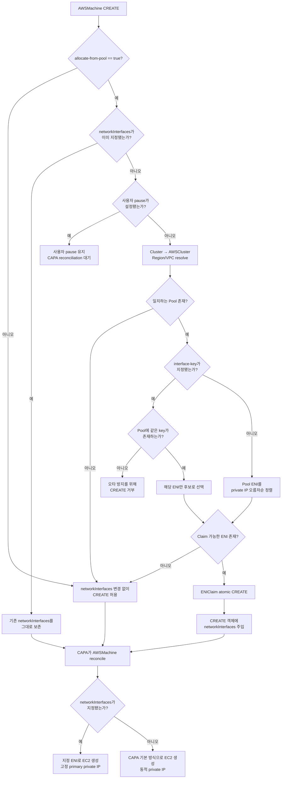
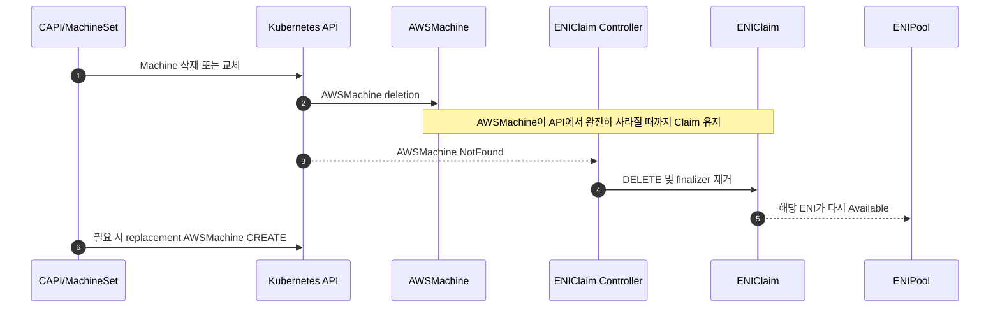

# CAPA ENI Controller 최종 동작 Flow

이 문서는 CAPA가 `AWSMachineTemplate`에서 `AWSMachine`을 생성할 때 사전 생성된
ENI를 선택하고 EC2의 primary private IP를 고정하는 최종 런타임 흐름을 설명한다.
현재 구현은 AWS API를 호출하지 않는 trust mode이며, Kubernetes에 선언된
`ENIPool`과 `ENIClaim`만을 기준으로 동작한다.

## 1. 구성요소 Topology



핵심은 ENI ID가 `AWSMachine`의 **CREATE admission 시점**에
`spec.networkInterfaces`에 포함된다는 점이다. CAPA v2.13은 생성된
`AWSMachine.spec` 변경을 금지하므로, 생성 후 Controller patch 방식은 사용하지
않는다.

## 2. 트리거 조건

| 구분 | 트리거 | 추가 조건 | 동작 |
| --- | --- | --- | --- |
| Pool 등록 | `ENIPool` CREATE/UPDATE | 선언 검증 통과 | Pool inventory status 계산 |
| ENI 할당 | `AWSMachine` CREATE admission | opt-in 값이 정확히 `"true"` | Region/VPC에 맞는 Pool 검색 및 Claim 시도 |
| key 지정 할당 | 위 ENI 할당 조건 + `interface-key` annotation | Pool에 같은 key가 존재 | 해당 ENI만 Claim 시도 |
| CAPA 기본 처리 | annotation 없음 또는 값이 `"true"`가 아님 | 없음 | JSON patch 없이 허용 |
| 사용자 지정 네트워크 보존 | `spec.networkInterfaces`가 이미 존재 | 없음 | 기존 값을 변경하지 않고 허용 |
| 사용자 pause 보존 | `cluster.x-k8s.io/paused`가 이미 존재 | 없음 | allocator가 개입하지 않고 허용 |
| Claim 상태 갱신 | `ENIClaim` CREATE/UPDATE | 참조 Pool과 Machine 존재 | `Bound` 및 선언 private IP 기록 |
| ENI 회수 | 참조 `AWSMachine`이 완전히 삭제됨 | admission transaction 유예시간 경과 | Claim finalizer 제거 및 Claim 삭제 |

사람이 입력하는 opt-in annotation의 위치는 다음과 같다.

```yaml
spec:
  template:
    metadata:
      annotations:
        eni.dcn.ssu.ac.kr/allocate-from-pool: "true"
```

`AWSMachineTemplate.metadata.annotations`가 아니라
`AWSMachineTemplate.spec.template.metadata.annotations`에 넣어야 CAPI가 생성하는
각 `AWSMachine`으로 복사한다.

특정 ENI 선택 annotation은 `MachineDeployment`의 Machine template에 넣는다.

```yaml
spec:
  template:
    metadata:
      annotations:
        eni.dcn.ssu.ac.kr/interface-key: edge-worker-1
```

이 값은 CAPI가 만든 `Machine`으로 복사되며 allocator가 AWSMachine의 owner를 통해
조회한다. AWSMachine 자체에도 같은 annotation이 있으면 그 값을 우선한다.

## 3. AWSMachine 생성 및 ENI 할당 Sequence



### 대표 operation

| 단계 | Kubernetes operation | 대상 | 목적 |
| --- | --- | --- | --- |
| Cluster 식별 | `GET` | `Cluster` | `cluster.x-k8s.io/cluster-name` label로 소속 Cluster 확인 |
| VPC 식별 | `GET` | `AWSCluster` | Region과 `spec.network.vpc.id` 확인 |
| Pool 선택 | `LIST` | `ENIPool` | Region과 VPC ID가 모두 같은 유일한 Pool 선택 |
| key 조회 | `GET` | owner `Machine` | MachineDeployment template에서 전파된 `interface-key` 확인 |
| 원자적 예약 | `CREATE` | `ENIClaim/<eni-id>` | 동시 요청 간 동일 ENI 중복 할당 방지 |
| ENI 주입 | admission JSON patch | `AWSMachine` | 최초 생성 spec에 `networkInterfaces` 포함 |
| EC2 생성 | CAPA의 AWS operation | EC2/ENI | 선택된 ENI를 primary interface로 사용 |
| 상태 반영 | `UPDATE status` | `ENIClaim`, `ENIPool` | Bound IP와 Pool inventory 표시 |

Pool 선택식은 다음과 같다.

```text
ENIPool.spec.region == AWSCluster.spec.region
AND
ENIPool.spec.vpcID == AWSCluster.spec.network.vpc.id
```

Pool에는 AZ와 subnet을 입력하지 않는다. 선택된 ENI가 이미 속한 subnet/AZ가 EC2의
네트워크 배치를 결정하며, 선언의 정확성은 운영자가 보장한다.

## 4. 분기 Flow



따라서 allocator의 정상 분기는 모두 CAPA reconciliation로 합류하고 EC2 생성으로
이어진다. 차이는 CAPA에 전달된 `networkInterfaces`의 유무뿐이다. 사용자가 명시적으로
pause한 경우와 admission 자체가 오류로 거부된 경우만 EC2 생성으로 즉시 이어지지
않는다.

현재 운영 기본값인 `exhaustionPolicy: Dynamic`에서는 일치하는 Pool이 없거나 모든
ENI가 Claim된 경우 `networkInterfaces`를 지정하지 않는다. 그러면 CAPA/AWS가 기존
방식으로 private IP를 동적 할당한다.

Admission dry-run 요청에서는 Claim을 생성하지 않는다. 따라서 server-side dry-run은
side effect 없이 통과하며 실제 예약은 실 CREATE 요청에서만 발생한다.

## 5. 삭제 및 회수 Sequence



Webhook은 Claim을 AWSMachine 저장 직전에 생성하므로 Claim Controller는 새 Claim에
짧은 유예시간을 적용한다. Admission이 성공하면 곧바로 AWSMachine을 찾을 수 있고,
Admission이 실패해 orphan Claim이 되면 유예시간 후 자동 삭제한다.

## 6. 관찰 가능한 결과와 점검 명령

정상 할당 시 다음 상태를 확인할 수 있다.

```yaml
metadata:
  annotations:
    eni.dcn.ssu.ac.kr/allocate-from-pool: "true"
    eni.dcn.ssu.ac.kr/allocation-result: Allocated
spec:
  networkInterfaces:
    - eni-0123456789abcdef0
```

대표 점검 명령은 다음과 같다.

```bash
kubectl get enipools
kubectl get eniclaims -o wide
kubectl get awsmachines,machines -A -o wide
kubectl logs -n capa-eni-controller-system \
  deployment/capa-eni-controller-controller-manager -c manager
```

검증할 핵심 불변식은 다음과 같다.

1. 하나의 ENI ID에는 활성 `ENIClaim`이 최대 하나만 존재한다.
2. `AWSMachine.spec.networkInterfaces[0]`와 Claim의 `spec.eniID`가 같다.
3. Machine의 `InternalIP`가 Pool에 선언한 해당 ENI의 `privateIP`와 같다.
4. opt-in하지 않은 AWSMachine에는 allocator가 변경을 가하지 않는다.
5. Controller와 Webhook은 AWS API를 직접 호출하지 않는다.
